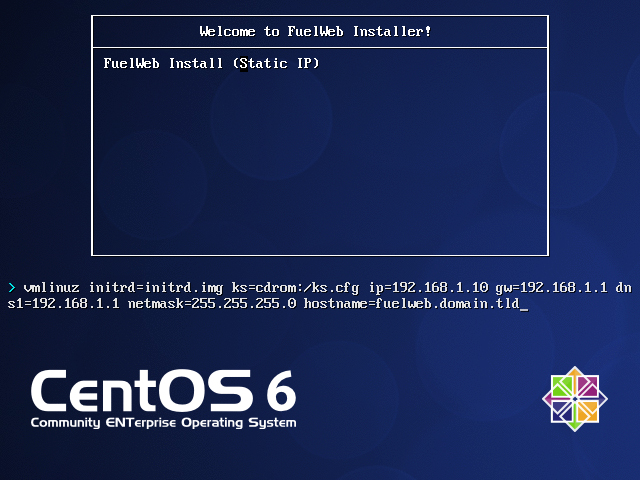

Installing Fuel Web
===================

.. contents:: :local:

Instructions
------------

Fuel Web is distributed as both an ISO and an IMG image, each of which contains an installer for an admin node. The ISO image is used for CD media devices, iLO or similar remote access systems. The IMG file is used for USB memory drives.

Once installed, FuelWeb can be used to deploy and manage OpenStack clusters. It will assign IP addresses to the nodes, perform PXE boot and initial configuration, and provision of OpenStack nodes according to their roles in the cluster.

On Physical Hardware
--------------------

To install FuelWeb on physical hardware, you need to burn the provided ISO to a CD/DVD, or IMG file to a USB stick, and start the installation process by booting from that media, very much like any other OS.

Linux and Mac users can prepare an installation USB stick with the ``dd`` command. For example, if your flash drive is ``/dev/sdb``, you can use following command line::
    
	dd if=fuelweb.img of=/dev/sdb

You can find the actual device name in the output of the ``dmesg`` command for Linux or ``diskutil list`` for MacOS.

On Windows, you can write the installation image with `Win32 Disk Imager <http://sourceforge.net/projects/win32diskimager/>`_.

After the installation is complete, you will need to allocate physical nodes for your OpenStack cluster, put them on the same L2 network as the admin node, and PXE boot. The UI will discover them and make them available for installing OpenStack. 

On VirtualBox
-------------

If you are going to evaluate Fuel Web on VirtualBox, you should know that we provide a set of scripts that create and configure all of the required VMs for you, including the admin node and slave nodes for OpenStack itself. It's a very simple, single-click installation.  (These scripts are not supported on Windows, but you can still test on VirtualBox by creating the VMs yourself.  See "Manual Mode" for more information.)

The requirements for running Fuel Web on VirtualBox are:

* A physical machine with Linux or Mac OS.

  * The scripts have been tested on Mac OS 10.7.5, Mac OS 10.8.3, and Ubuntu 12.04.

* VirtualBox must be installed with the extension pack. Both can be downloaded from `<http://www.virtualbox.org/>`_.

  * The scripts have been tested using VirtualBox 4.2.12

* 8 GB+ of RAM

  * to handle 4 VMs for non-HA OpenStack installation (1 admin node, 1 controller node, 1 compute node, 1 cinder node) 
  * to handle 5 VMs for HA OpenStack installation (1 admin node, 3 controller nodes, 1 compute node) 

Automatic mode
^^^^^^^^^^^^^^

When you unpack the scripts, you will see the following important files and folders:

* iso

  * This folder needs to contain a single ISO image for Fuel Web. Once you download ISO from the portal, copy or move it into this directory

* config.sh

  * This file contains configuration, which can be fine-tuned. For example, you can select how many virtual nodes to launch, as well as how much memory to give them.

* launch.sh

  * Once executed, this script will pick up an image from the ``iso`` directory, create a VM, mount the image to this VM, and automatically install the admin node.
  * After installation of the admin node, the script creates slaves for OpenStack and PXE-boots them from the admin node.
  * Finally, the script gives you the link to access the Web-based UI for the admin node so you can start installation of an OpenStack cluster.

Here is the example config file, with the values that you can adjust:

.. literalinclude:: /../virtualbox/config.sh
   :language: bash

Manual mode
^^^^^^^^^^^

If you cannot or would rather not run the convenience scripts, you can still run Fuel Web on VirtualBox by following these steps.

Admin node deployment
~~~~~~~~~~~~~~~~~~~~~

First, create the admin node.

1. Configure the host-only interface vboxnet0 in VirtualBox.

  * IP address: 10.20.0.1
  * Interface mask: 255.255.255.0
  * DHCP disabled

2. Create a VM for the admin node with the following parameters:

  * OS Type: Linux, Version: Red Hat (64bit)
  * RAM: 1024 MB
  * HDD: 16 GB, with dynamic disk expansion
  * CDROM: mount iso installer
  * Network 1: host-ony interface vboxnet0

3. Power on the VM in order to start the installation.

4. Wait for the welcome message with all information needed to login into the UI of Fuel Web.

Adding slave nodes
~~~~~~~~~~~~~~~~~~

Next, create nodes on which to install OpenStack.

1. Create VMs with the following parameters:

* OS Type: Linux, Version: Red Hat (64bit)
* RAM: 768 MB
* HDD: 16 GB, with dynamic disk expansion
* Network 1: host-only interface vboxnet0, PCnet-FAST III device

2. Set priority for the network boot:

.. image:: _static/vbox-image1.png

3. Configure the network adapter on each VM:

.. image:: _static/vbox-image2.png

Changing network parameters
---------------------------

You can change network settings for admin (PXE booting) network, which is 10.20.0.2/24 gw 10.20.0.1 by default.

In order to do so, press the <TAB> key аt the very first installation screen which says
"Welcome to FuelWeb Installer!" and update the kernel options. For example, to use 192.168.1.10/24
IP address for the master node with 192.168.1.1 as gateway and DNS server you should change the parameters to the shown on picture:

When you're finished making changes, press the Enter key and wait for the installation to complete.

Changing network parameters after booting
~~~~~~~~~~~~~~~~~~~~~~~~~~~~~~~~~~~~~~~~~

Once IP settings are set at the boot time for FuelWeb master node, it **must not be changed during the whole lifecycle of FuelWeb.**
It is still possible to configure other interfaces, or add 802.1Q subinterfaces to the FuelWeb to be able to access it from office network
if required.
It is easy to do via standard network configuration scripts for CentOS. When the installation is complete,
you can modify /etc/sysconfig/network-scripts/ifcfg-eth* scripts. For example, if *eth1* interface is on the L2 network which is planned
for PXE booting, and *eth2* is the interface connected to office network switch, *eth0* is not in use, then settings can be the following:

/etc/sysconfig/network-scripts/ifcfg-eth0:
| DEVICE=eth0
| ONBOOT=no

/etc/sysconfig/network-scripts/ifcfg-eth1:
| DEVICE=eth1
| ONBOOT=yes
| HWADDR=<your MAC>
| ..... (other settings in your config) .....
| PEERDNS=no
| BOOTPROTO=static
| IPADDR=192.168.1.10
| NETMASK=255.255.255.0

/etc/sysconfig/network-scripts/ifcfg-eth2:
| DEVICE=eth2
| ONBOOT=yes
| HWADDR=<your MAC>
| ..... (other settings in your config) .....
| PEERDNS=no
| IPADDR=172.18.0.5
| NETMASK=255.255.255.0

Now you should be able to connect to the FuelWeb from office network via `<http://172.18.0.5:8000/>`_
