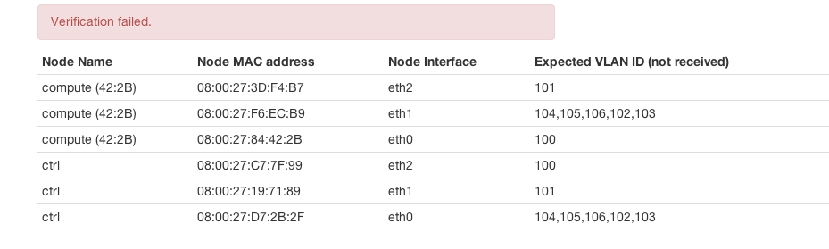

Network Issues
==============

.. contents:: :local:

FuelWeb has built-in capability to run network check before or after OpenStack deployment. Currently it can check
connectivity between nodes within configured VLANs on configured server interfaces. Image below shows sample
result of such check. By using this simple table it is easy to say which interfaces do not receive certain VLAN IDs.
Usually it measn that switch or multiple switches are not configured correctly and do not allow certain tagged
traffic to pass through.

On VirtualBox
-------------

Scripts which are provided for quick FuelWeb setup, create 3 host-interface adapters. Basically
networking works as this being a 3 bridges, in each of them the only one VMs interfaces is connected.
It means there is only L2 connectivity between VMs on interfaces named by the same name.
If you try to move, for example, management network to eth1 on controller node, and the same network
to eth2 on the compute, then there will be no connectivity between OpenStack services in spite of being
configured to live on the same VLAN.
It easy to validate settings before deploy by clicking on "Verify Networks" button before deployment.
