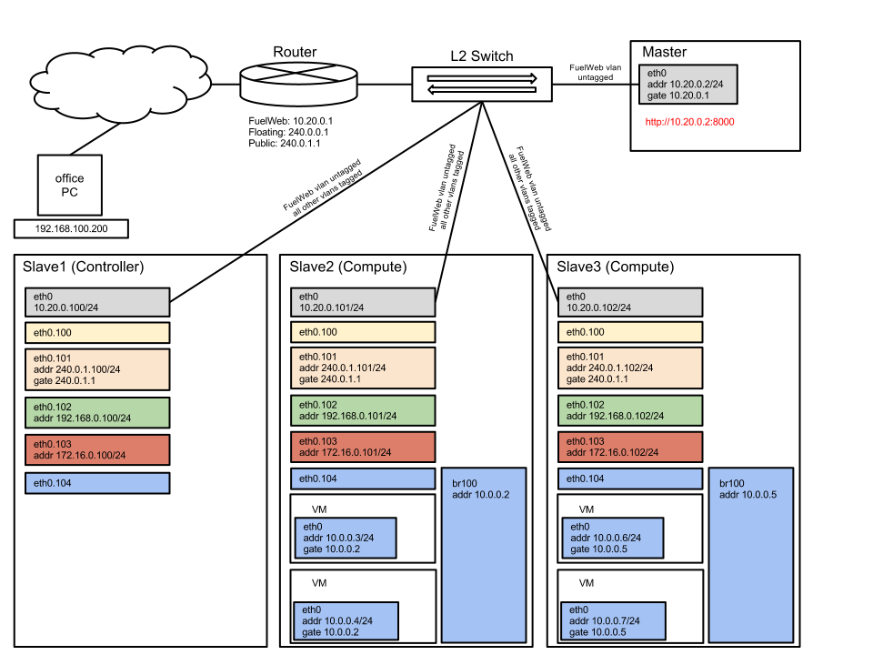

Understanding and configuring network
=====================================

.. contents:: :local:

There are two basic types of network managers used in OpenStack clusters. The first one is so called
flat manager and the second one is vlan manager. For more information about how they work one can read
the following blog posts.

* `OpenStack Networking – FlatManager and FlatDHCPManager <http://www.mirantis.com/blog/openstack-networking-flatmanager-and-flatdhcpmanager/>`_
* `Openstack Networking for Scalability and Multi-tenancy with VlanManager <http://www.mirantis.com/blog/openstack-networking-vlanmanager/>`_

Available Options
-----------------

Flat Manager (multi-interface scheme)
^^^^^^^^^^^^^^^^^^^^^^^^^^^^^^^^^^^^^

The main idea behind flat network manager is to configure bridge (let say **br100**) on every compute
node and to connect it to some interface. Once virtual machine is launched its virtual interface is
connected to that bridge. So there is no L2 isolation between virtual hosts even if they in different
tenants. That is why it is called *flat* manager. Therefore only one flat IP pool defined throughout
the whole cluster.

The most simple case here is as shown on the following diagram. Here **eth0** interface is used to
give network access to virtual machines while **eth1** interface is the management network interface.

 .. uml::
    node "Compute1" {
        [eth0\nVM] as compute1_eth0
        [eth1\nManagement] as compute1_eth1
        [vm0] as compute1_vm0
        [vm1] as compute1_vm1
        [br100] as compute1_br100
        compute1_br100 -up- compute1_eth0
        compute1_vm0 -up- compute1_br100
        compute1_vm1 -up- compute1_br100
    }

    node "Compute2" {
        [eth0\nVM] as compute2_eth0
        [eth1\nManagement] as compute2_eth1
        [vm0] as compute2_vm0
        [vm1] as compute2_vm1
        [br100] as compute2_br100
        compute2_br100 -up- compute2_eth0
        compute2_vm0 -up- compute2_br100
        compute2_vm1 -up- compute2_br100
    }

    node "Compute3" {
        [eth0\nVM] as compute3_eth0
        [eth1\nManagement] as compute3_eth1
        [vm0] as compute3_vm0
        [vm1] as compute3_vm1
        [br100] as compute3_br100
        compute3_br100 -up- compute3_eth0
        compute3_vm0 -up- compute3_br100
        compute3_vm1 -up- compute3_br100
    }

    compute1_eth0 -up- [L2 switch]
    compute2_eth0 -up- [L2 switch]
    compute3_eth0 -up- [L2 switch]
    compute1_eth1 .up. [L2 switch]
    compute2_eth1 .up. [L2 switch]
    compute3_eth1 .up. [L2 switch]

Flat management mode in turn can be configured both with single nova-network instance typically
installed on controller node and with multiple nova-network instances one for every compute node.
In the first case there is no assigned IP on **br100** bridge and it works as fully L2 device. In
the last case you install nova-network on every compute node and assign IP on **br100** so it will
be used as default gateway on virtual machines. Besides it is crucial that the **eth0** interfaces
on all compute nodes have promiscuous mode enabled. Promiscuous mode allows the interface to receive
packets not targeted to this interface’s MAC address but to vm's MAC address.

Flat Manager (single-interface scheme)
^^^^^^^^^^^^^^^^^^^^^^^^^^^^^^^^^^^^^^

However we use a bit different scheme for flat manager mode. It is supposed that all compute nodes are
connected to the network with only one physical interface **eth0**. In order to split virtual machines
traffic from other types of traffic (for example management traffic) we use vlans on **eth0**. User can
consider them as several different physical interfaces. We install nova-network on all compute nodes and
it creates **br100** bridge and connect it to VM vlan interface **eth0.102**. Then it assigns IP address
on **br100** bridge and use it as default gateway for virtual machines. IP address for **br100** will be
choosen automatically from the user defined range.

 .. uml::
    node "Compute1 Node" {
        [eth0] as compute1_eth0
        [eth0.101\nManagement] as compute1_eth0_101
        [eth0.102\nVM] as compute1_eth0_102
        [vm0] as compute1_vm0
        [vm1] as compute1_vm1
        [vm2] as compute1_vm2
        [vm3] as compute1_vm3
        [br100] as compute1_br100
        compute1_eth0 -down- compute1_eth0_101
        compute1_eth0 -down- compute1_eth0_102
        compute1_eth0_102 -down- compute1_br100
        compute1_br100 -down- compute1_vm0
        compute1_br100 -down- compute1_vm1
        compute1_br100 -down- compute1_vm2
        compute1_br100 -down- compute1_vm3
    }

    node "Compute2 Node" {
        [eth0] as compute2_eth0
        [eth0.101\nManagement] as compute2_eth0_101
        [eth0.102\nVM] as compute2_eth0_102
        [vm0] as compute2_vm0
        [vm1] as compute2_vm1
        [vm2] as compute2_vm2
        [vm3] as compute2_vm3
        [br100] as compute2_br100
        compute2_eth0 -down- compute2_eth0_101
        compute2_eth0 -down- compute2_eth0_102
        compute2_eth0_102 -down- compute2_br100
        compute2_br100 -down- compute2_vm0
        compute2_br100 -down- compute2_vm1
        compute2_br100 -down- compute2_vm2
        compute2_br100 -down- compute2_vm3
    }

    compute1_eth0 -up- [L2 switch]
    compute2_eth0 -up- [L2 switch]

Therefore all switch ports where compute nodes are connected must be configured as tagged (trunk) ports
with vlans 101 and 102 allowed (enabled). Virtual machines will communicate with each other on L2 even
if they on different compute nodes. However if virtual machine sends IP packets outside flat VM network
they will be routed on the host machine.

VLAN manager
^^^^^^^^^^^^

Vlan manager mode is more suitable for large scale clouds. The idea behind this mode is to define vlan
range and assign those vlans to given tenants. So virtual machines inside given tenant communicate with
each other on L2 while all other IP packets are routed on compute nodes where nova-network instances
are running. In this case all switch ports where compute nodes are connected also must be configured
as tagged (trunk) ports.

.. uml::
    node "Compute1 Node" {
        [eth0] as compute1_eth0
        [eth0.101\nManagement] as compute1_eth0_101
        [vlan102\n] as compute1_vlan102
        [vlan103\n] as compute1_vlan103
        [vm0] as compute1_vm0
        [vm1] as compute1_vm1
        [vm2] as compute1_vm2
        [vm3] as compute1_vm3
        [br102] as compute1_br102
        [br103] as compute1_br103
        compute1_eth0 -down- compute1_eth0_101
        compute1_eth0 -down- compute1_vlan102
        compute1_eth0 -down- compute1_vlan103
        compute1_vlan102 -down- compute1_br102
        compute1_vlan103 -down- compute1_br103
        compute1_br102 -down- compute1_vm0
        compute1_br102 -down- compute1_vm1
        compute1_br103 -down- compute1_vm2
        compute1_br103 -down- compute1_vm3
    }

    node "Compute2 Node" {
        [eth0] as compute2_eth0
        [eth0.101\nManagement] as compute2_eth0_101
        [vlan102\n] as compute2_vlan102
        [vlan103\n] as compute2_vlan103
        [vm0] as compute2_vm0
        [vm1] as compute2_vm1
        [vm2] as compute2_vm2
        [vm3] as compute2_vm3
        [br102] as compute2_br102
        [br103] as compute2_br103
        compute2_eth0 -down- compute2_eth0_101
        compute2_eth0 -down- compute2_vlan102
        compute2_eth0 -down- compute2_vlan103
        compute2_vlan102 -down- compute2_br102
        compute2_vlan103 -down- compute2_br103
        compute2_br102 -down- compute2_vm0
        compute2_br102 -down- compute2_vm1
        compute2_br103 -down- compute2_vm2
        compute2_br103 -down- compute2_vm3
    }

    compute1_eth0 -up- [L2 switch]
    compute2_eth0 -up- [L2 switch]

Making Configuration
--------------------

Scheme
^^^^^^

Once you figure out the network scheme for your future cloud, you need to configure your equipment according to this scheme. Note that the IP addresses in your case will differ from those shown in the diagrams.

By default we use several predefined networks:

* **FuelWeb** network is used for internal FuelWeb communications only (untagged on the scheme);
* **Public** network used to get access from virtual machines to outside OpenStack cluster (vlan 101 on the scheme);
* **Floating** network is used to get access to virtual machines from outside OpenStack cluster (shared L2-interface with **Public** network, in this case it's vlan 101);
* **Management** network is used for internal OpenStack communications (vlan 102 on the scheme);
* **Storage** network is used for storage traffic (vlan 103 on the scheme);
* One (for flat mode) or more (for vlan mode) virtual machine network(s). (vlan 104 on the scheme).

Switch
^^^^^^

Now is the point where you need to configure L2 switch so that all nodes are connected to switch
ports where "**FuelWeb**" vlan frames untagged (without vlan tags) and all other frames tagged (with vlan
tags). Vlans 101-104 must not be filtered on those ports. It is crucial to isolate all used vlans
from the rest of your network on L2 because in other case DHCP server on master node can send
invalid DHCP offers to DHCP clients inside your network and vise versa slave nodes can get invalid
DHCP offers from DHCP servers outside scheme. Also you need to configure each of the switch's ports connected
to nodes as an "STP Edge port" (or a "spanning-tree portfast trunk" according to Cisco terminology).
If you don't do that, some DHCP timeout issues can occur. Once master node is installed and slave nodes are
booted in bootstrap mode you are able to use "Network Verification" feature in order to check
validity of vlan configuration on L2 switch.

Router
^^^^^^

To make virtual machines able to get access to the outside of OpenStack cluster it is needed to configure
address 240.0.1.1 on the "**Public**" (vlan 101) router interface. Cluster nodes will use this address as
default gateway. In turn, to get access from the outside of cluster to virtual machine via, for example,
ssh you need to use "**Floating**" IP address which could be assigned to given virtual machine via OpenStack
dashboard. You also need to configure corresponding IP address 240.0.0.1 on the "**Floating**" (vlan 101)
router interface. Besides, to get access from the outside to http://10.20.0.2:8000 you also need to
configure gateway address 10.20.0.1 on "**FuelWeb**" vlan interface (untagged on the scheme). Private
OpenStack networks (vlans 102, 103, 104) should not be configured on router as they used completely
inside cluster.

Admin Node
^^^^^^^^^^

During master node installation it is assumed that there is a recursive DNS service on 10.20.0.1.

If you want to make slave nodes able to resolve public names you need to change this default value to
point on actual DNS service. This value can be changed via text based dialog provided by anaconda.
It is implemented in anaconda kickstart in post install section. Slave nodes use DNS service running
on master node and provided by cobbler and it relays requests to the actual DNS service if it does
not have information about requested name.

Once master node is installed you have to power on all other nodes and go to the url http://10.20.0.2:8000.
Slave nodes will be booted in bootstrap mode via PXE and you will see notifications on user interface
about discovered nodes. Here is the point where you can configure your cluster. It is supposed that
on the network tab you choose configuration shown on the following figure.

.. image:: _static/web_network_tab.png

