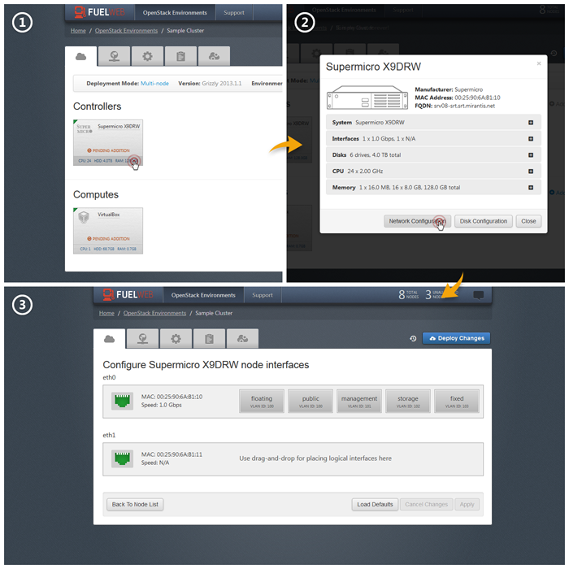

Understanding and configuring the network
=========================================

.. contents:: :local:

OpenStack clusters use several types of network managers: FlatDHCP, VlanManager and Quantum.
The current version of FuelWeb supports only the first two (FlatDHCP and VlanManager), but the FUEL library supports all three of them.
For more information about how the first two network managers work, you can read these two resources:

* `OpenStack Networking – FlatManager and FlatDHCPManager <http://www.mirantis.com/blog/openstack-networking-flatmanager-and-flatdhcpmanager/>`_
* `Openstack Networking for Scalability and Multi-tenancy with VlanManager <http://www.mirantis.com/blog/openstack-networking-vlanmanager/>`_

FlatDHCP Manager (multi-host scheme)
------------------------------------

OpenStack basics
^^^^^^^^^^^^^^^^
The main idea behind the flat network manager is to configure a bridge (i.e. **br100**) on every compute
node and have one of the machine's host interfaces connect to it. Once the virtual machine is launched 
its virtual interface will connect to that bridge as well.
The same L2 segment is used for all OpenStack projects, and it means that there is no L2 isolation between
virtual hosts, even if they are owned by separated projects. For this reason it is called *Flat* manager.

The simplest case here is as shown on the following diagram. Here the **eth1** interface is used to
give network access to virtual machines, while **eth0** interface is the management network interface.

 .. uml::
    node "Compute1" {
        [eth1\nVM] as compute1_eth1
        [eth0\nManagement] as compute1_eth0
        [vm0] as compute1_vm0
        [vm1] as compute1_vm1
        [br100] as compute1_br100
        compute1_br100 -up- compute1_eth1
        compute1_vm0 -up- compute1_br100
        compute1_vm1 -up- compute1_br100
    }

    node "Compute2" {
        [eth1\nVM] as compute2_eth1
        [eth0\nManagement] as compute2_eth0
        [vm0] as compute2_vm0
        [vm1] as compute2_vm1
        [br100] as compute2_br100
        compute2_br100 -up- compute2_eth1
        compute2_vm0 -up- compute2_br100
        compute2_vm1 -up- compute2_br100
    }

    node "Compute3" {
        [eth1\nVM] as compute3_eth1
        [eth0\nManagement] as compute3_eth0
        [vm0] as compute3_vm0
        [vm1] as compute3_vm1
        [br100] as compute3_br100
        compute3_br100 -up- compute3_eth1
        compute3_vm0 -up- compute3_br100
        compute3_vm1 -up- compute3_br100
    }

    compute1_eth1 -up- [L2 switch]
    compute2_eth1 -up- [L2 switch]
    compute3_eth1 -up- [L2 switch]
    compute1_eth0 .up. [L2 switch]
    compute2_eth0 .up. [L2 switch]
    compute3_eth0 .up. [L2 switch]

FuelWeb deployment schema
^^^^^^^^^^^^^^^^^^^^^^^^^

FuelWeb deploys OpenStack in FlatDHCP mode with the so called **multi-host** feature enabled.
Without this feature enabled, network traffic from each VM would go through the single
gateway host, which basically becomes a single point of failure. In enabled mode, each compute node becomes a
gateway for all the VMs running on the host, providing a balanced networking solution.
In this case, if one of the computes goes down, the rest of the environment remains operational.

The current version of FuelWeb uses VLANs, even for the FlatDHCP network manager.
On the Linux host, it is implemented in such a way that it is not the physical network interfaces that is
connected to the bridge, but the VLAN interface (i.e. **eth0.102**).

 .. uml::
    node "Compute1 Node" {
        [eth0] as compute1_eth0
        [eth0.101\nManagement] as compute1_eth0_101
        [eth0.102\nVM] as compute1_eth0_102
        [vm0] as compute1_vm0
        [vm1] as compute1_vm1
        [vm2] as compute1_vm2
        [vm3] as compute1_vm3
        [br100] as compute1_br100
        compute1_eth0 -down- compute1_eth0_101
        compute1_eth0 -down- compute1_eth0_102
        compute1_eth0_102 -down- compute1_br100
        compute1_br100 -down- compute1_vm0
        compute1_br100 -down- compute1_vm1
        compute1_br100 -down- compute1_vm2
        compute1_br100 -down- compute1_vm3
    }

    node "Compute2 Node" {
        [eth0] as compute2_eth0
        [eth0.101\nManagement] as compute2_eth0_101
        [eth0.102\nVM] as compute2_eth0_102
        [vm0] as compute2_vm0
        [vm1] as compute2_vm1
        [vm2] as compute2_vm2
        [vm3] as compute2_vm3
        [br100] as compute2_br100
        compute2_eth0 -down- compute2_eth0_101
        compute2_eth0 -down- compute2_eth0_102
        compute2_eth0_102 -down- compute2_br100
        compute2_br100 -down- compute2_vm0
        compute2_br100 -down- compute2_vm1
        compute2_br100 -down- compute2_vm2
        compute2_br100 -down- compute2_vm3
    }

    compute1_eth0 -up- [L2 switch]
    compute2_eth0 -up- [L2 switch]

Therefore all switch ports where compute nodes are connected must be configured as tagged (trunk) ports
with required vlans allowed (enabled, tagged). Virtual machines will communicate with each other on L2 even
if they are on different compute nodes. If the virtual machine sends IP packets to a different network, 
they will be routed on the host machine according to the routing table. The default route will point to the
gateway specified on the networks tab in the UI as the gateway for the public network.

VLAN Manager
^^^^^^^^^^^^

OpenStack basics
^^^^^^^^^^^^^^^^

Vlan manager mode is more suitable for large scale clouds. The idea behind this mode is to separate
groups of virtual machines, owned by different projects, on L2 layer. In VLAN Manager it is done by
tagging IP frames, or simply speaking, by VLANs. It allows virtual machines inside the given project
to communicate with each other and not to see any traffic from VMs of other projects.
Switch ports must be configured as tagged (trunk) ports to allow this scheme to work.

.. uml::
    node "Compute1 Node" {
        [eth0] as compute1_eth0
        [eth0.101\nManagement] as compute1_eth0_101
        [vlan102\n] as compute1_vlan102
        [vlan103\n] as compute1_vlan103
        [vm0] as compute1_vm0
        [vm1] as compute1_vm1
        [vm2] as compute1_vm2
        [vm3] as compute1_vm3
        [br102] as compute1_br102
        [br103] as compute1_br103
        compute1_eth0 -down- compute1_eth0_101
        compute1_eth0 -down- compute1_vlan102
        compute1_eth0 -down- compute1_vlan103
        compute1_vlan102 -down- compute1_br102
        compute1_vlan103 -down- compute1_br103
        compute1_br102 -down- compute1_vm0
        compute1_br102 -down- compute1_vm1
        compute1_br103 -down- compute1_vm2
        compute1_br103 -down- compute1_vm3
    }

    node "Compute2 Node" {
        [eth0] as compute2_eth0
        [eth0.101\nManagement] as compute2_eth0_101
        [vlan102\n] as compute2_vlan102
        [vlan103\n] as compute2_vlan103
        [vm0] as compute2_vm0
        [vm1] as compute2_vm1
        [vm2] as compute2_vm2
        [vm3] as compute2_vm3
        [br102] as compute2_br102
        [br103] as compute2_br103
        compute2_eth0 -down- compute2_eth0_101
        compute2_eth0 -down- compute2_vlan102
        compute2_eth0 -down- compute2_vlan103
        compute2_vlan102 -down- compute2_br102
        compute2_vlan103 -down- compute2_br103
        compute2_br102 -down- compute2_vm0
        compute2_br102 -down- compute2_vm1
        compute2_br103 -down- compute2_vm2
        compute2_br103 -down- compute2_vm3
    }

    compute1_eth0 -up- [L2 switch]
    compute2_eth0 -up- [L2 switch]

FuelWeb deployment schema
^^^^^^^^^^^^^^^^^^^^^^^^^

One of the physical interfaces on each host has to be chosen to carry VM-to-VM traffic (fixed network),
and switch ports must be configured to allow tagged traffic to pass through. OpenStack Computes will
untag the IP packets and send them to the appropriate VMs.
Simplifying the configuration of VLAN Manager, there is no known limitation which FuelWeb could add
in this particular networking mode.

Configuring the network
-----------------------

Scheme
^^^^^^

Once the networking mode is chosen (FlatDHCP/Vlan), you must configure equipment according
to this scheme. The diagram below shows an example configuration.

.. image:: _static/flat.png

FuelWeb operates with following logical networks:

* **FuelWeb** network is used for internal FuelWeb communications only and PXE booting (untagged on the scheme);
* **Public** network is used to get access from virtual machines to outside, Internet or office network (vlan 101 on the scheme);
* **Floating** network is used to get access to virtual machines from outside (shared L2-interface with **Public** network; in this case it's vlan 101);
* **Management** network is used for internal OpenStack communications (vlan 102 on the scheme);
* **Storage** network is used for storage traffic (vlan 103 on the scheme);
* **Fixed** - one (for flat mode) or more (for vlan mode) virtual machines network(s) (vlan 104 on the scheme).

Mapping logical networks to physical interfaces on servers
^^^^^^^^^^^^^^^^^^^^^^^^^^^^^^^^^^^^^^^^^^^^^^^^^^^^^^^^^^

FuelWeb allows to use different physical interfaces to run different types of traffic.
When node is added to the environment, click at the bottom line of node icon.
In the opened window with detailed information, click "Network Configuration" button to open
physical interfaces configuration screen.

On this screen you can drag-and-drop logical networks to physical interfaces according
to your network setup. 

All networks are presented on the screen, except **FuelWeb**.
It runs on the physical interface from which node was initially PXE booted,
and in the current version it is not possible to map it on any other physical interface.
Another limitation is that once network is configured and OpenStack is deployed,
it is not possible to modify network settings, even to move any logical network
to the other physical interface or VLAN number.

Switch
^^^^^^

FuelWeb can configure hosts, however switch configuration is still manual work.
Unfortunately the set of configuration steps, and even the terminology used, is different for different vendors,
so we will try to provide vendor-agnostic information on how traffic should flow and leave the
vendor-specific details to you. We will provide an example for a Cisco switch.

First of all, you must configure access ports to allow non-tagged PXE booting connections
from all slave nodes to the FuelWeb node. We refer this network as the "admin" network, or "fuelweb".
By default, the FuelWeb master node uses the ``eth0`` interface to serve PXE requests in this network.
So if that's left unchanged, you must set the switch port for eth0 of FuelWeb to access mode.
We recommend that you use the eth0 interfaces of all other nodes for PXE booting as well.  Corresponding ports
must be in access mode as well.

Taking into account that this is the network for PXE booting, you must not mix this
L2 segment with any other company infrastructure. FuelWeb runs a DHCP server, and if there is
another company DHCP on the same L2, both the company's infrastructure and FuelWeb's will be unable to function properly.
You also need to configure each of the switch's ports connected
to nodes as an "STP Edge port" (or a "spanning-tree portfast trunk", according to Cisco terminology).
If you don't do that, DHCP timeout issues may occur.

As long as the "admin" network is configured, FuelWeb can operate. Other networks are required
for OpenStack environments, and currently all of these networks live in VLANs over the one or multiple
physical interfaces on a node. This means that the switch should pass tagged traffic, and untagging is done
on the Linux hosts. *For the sake of simplicity, all the VLANs specified on the networks tab of the FuelWeb UI
should be configured on switch ports, pointing to slave nodes, as tagged.* Of course, it is
possible to specify as tagged only certain ports for a certain nodes. For example, there is no
need to pass the public network to Cinder hosts.

This is enough to deploy the OpenStack environment. However it will not really be usable because
there is no connection to other corporate networks yet. To make that possible, you must configure uplink port(s). 
One of the VLANs may carry the office network. To provide access to the FuelWeb WebUI
from the office network, any other free physical network interface on the FuelWeb master node can be used
and configured according to the office network rules (static IP or DHCP). The same corporate
network segment can be used for public and floating ranges. In this case, you must
provide the corresponding VLAN ID and IP ranges in the UI. One public IP per node will be used to SNAT
traffic out of the VMs network, and one or more floating addresses per VM instance will be used to get
access to the VM from the corporate network, or even the global Internet. To have a VM visible from the 
Internet is similar to having it visible from corporate network - corresponding IP ranges and VLAN IDs
must be specified for the floating and public networks. One current limitation of FuelWeb is that the user
must use the same L2 segment for both public and floating networks.

Example configuration for one of the ports on a Cisco switch html::

  interface GigabitEthernet0/6               # switch port
  description s0_eth0 jv                     # description
  switchport trunk encapsulation dot1q       # enables VLANs
  switchport trunk native vlan 262           # access port, untags VLAN 262
  switchport trunk allowed vlan 100,102,104  # 100,102,104 VLANs are passed with tags
  switchport mode trunk                      # To allow more than 1 VLAN on the port
  spanning-tree portfast trunk               # STP Edge port to skip network loop checks (to prevent DHCP timeout issues)
  vlan 262,100,102,104                       # Might be needed for enabling VLANs

Router
^^^^^^

To make it possible for VMs to access the outside world, you must have an IP address set on a router in the public network.
In the examples provided, that IP is 240.0.1.1 in VLAN 101. FuelWeb has a special field on the networking tab for the
gateway address. As soon as deployment of OpenStack is started, the network on nodes is reconfigured
to use this gateway IP as the default gateway.
If floating addresses are from another other L3 network, then you must set the IP (or even multiple
IPs if floating addresses are from more than one L3 network) for them on the router as well.
Otherwise, floating IPs on nodes will be inaccessible.
