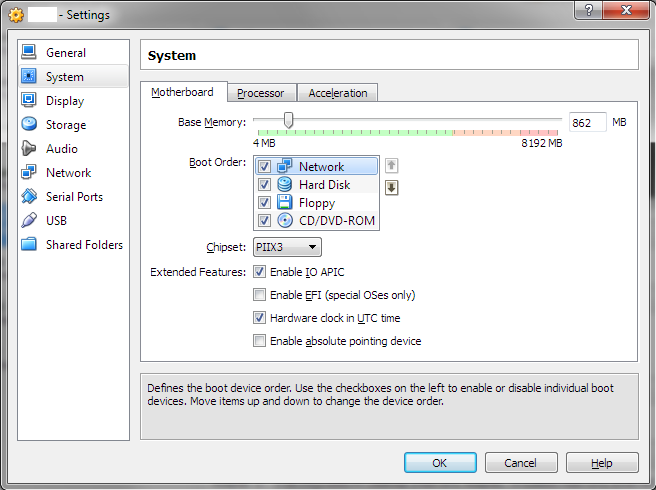
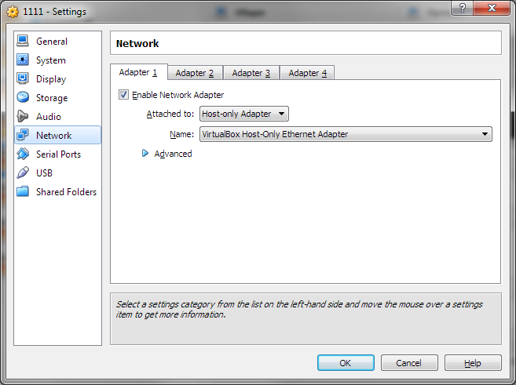

Using VirtualBox to deploy nailgun and slave nodes.
===================================================

Pre-requirements
----------------

This instruction has been tested on following environments:

* Ubuntu Linux 12.04, VirtualBox 4.1.22r80657 + Extension Pack 4.1.14r77440
* Windows 7 SP1, VirtualBox 4.2.4 + Extension Pack
* MacOS 10.6.8, VirtualBox 4.2.4 + Extension Pack

Extension pack is required and can be downloaded from the www.virtualbox.org

Nailgun server deployment
-------------------------

1. Create VM with the following parameters:

* OS Type: Linux, Version: Red Hat (64bit)
* RAM: 1Gb
* HDD: 8Gb
* CDROM: nailgun iso
* Network 1: host-only adapter

2. Power on Nailgun VM.

(optional) You can change default network settings (10.20.0.2/24 gw 10.20.0.1).
To do so press <TAB> аt "Welcome to Nailgun CentOS 6.3" screen and update kernel
options. For example, to use 192.168.1.10/24 network for nailgun with 192.168.1.1 as gateway and DNS server you should change params to look like:
vmlinuz initrd=initrd.img ks=cdrom:/ks.cfg ip=192.168.1.10 gw=192.168.1.1 dns1=192.168.1.1 netmask=255.255.255.0.
After that press Enter and wait for installation complete.

3. Wait for "Welcome to the Nailgun server" message with all information needed to login into the UI of Nailgun.

Adding slave nodes
----------------------

You need at least one VM for single node deployment, two machines for multi-node, three machines for HA-mode.

Create VMs with the following parameters:

* OS Type: Linux, Version: Red Hat (64bit)
* RAM: 1Gb
* HDD: 8Gb
* Network 1: host-only adapter with the same network as for nailgun VM.

You should select for nodes network boot as that 1-st method to use.

Network setup on VM's
---------------------
Example of network setup on nodes/nailgun VM's.

